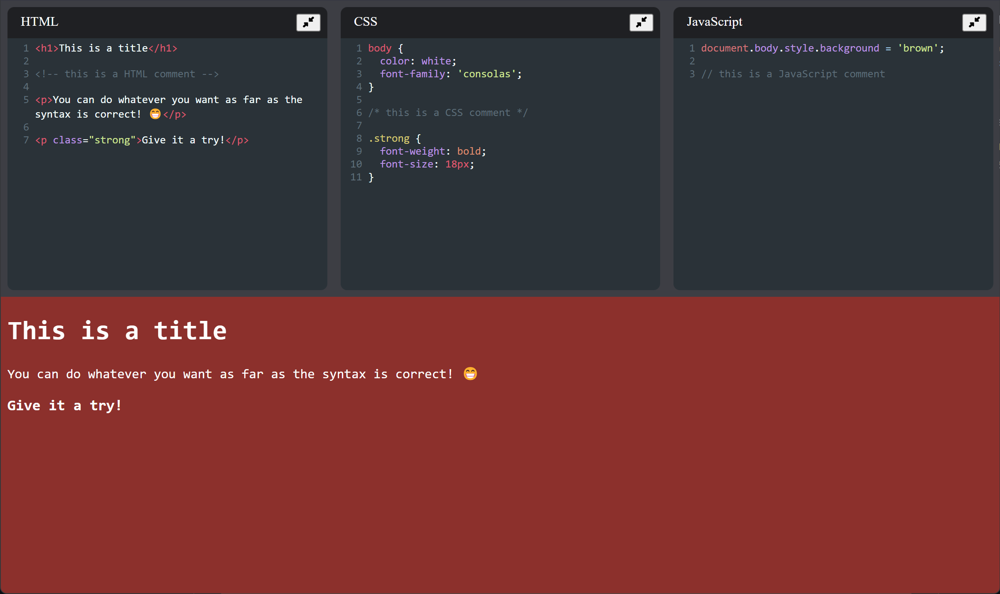

# CodePen Clone

A codepen clone 🪞



# Technologies

- [React](https://reactjs.org/docs/getting-started.html)
- [HTML](https://developer.mozilla.org/pt-BR/docs/Web/HTML)
- [CSS](https://developer.mozilla.org/pt-BR/docs/Web/CSS)
- [JavaScript](https://developer.mozilla.org/en-US/docs/Web/JavaScript)

# Setup

## Clone repository

Create and go to the directory where you want to place the repository

```bash
  cd my-directory
```

Clone the project

```bash
  git clone https://github.com/pncsoares/codepen-clone.git
```

Go to the project directory

```bash
  cd codepen-clone
```

# Run the app

## Install dependencies

Open terminal and run the following command:
```bash
  npm i
```

## Run

Execute the following command:
```bash
  npm start
```

A browser page will open automatically 🪄

# License

MIT